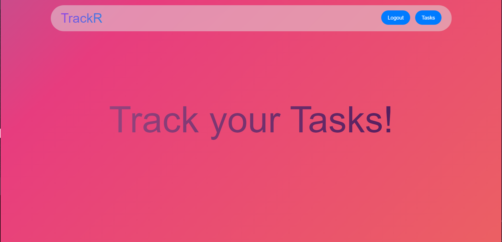

# Project Overview

## 1. Tech Stacks

### Server-side:

- **Spring Boot**: Backend framework
- **Spring Security**: Security framework
- **JWT Authentication**: Token-based authentication
- **MongoDB**: Database
- **WebSockets**: Real-time communication

### Client-side:

- **ReactJS**: Frontend framework
- **WebSockets**: Real-time updates

The Application is Deployed onto a Digital Ocean Droplet and can be accessed here: http://137.184.164.163:3000/

## 2. Dockerization

- The entire application is dockerized.
- Docker Compose is used for orchestration.
- Docker images are pushed to DockerHub for deployment on any remote server.

### Steps to Run with Docker:

1. Clone the repository:

   ```bash
   git clone https://github.com/sbk2k1/Task-Tracker-Application.git
   ```

2. Navigate to the project directory:

   ```bash
   cd Task-Tracker-Application
   ```

3. Run the following command:

   ```bash
   docker-compose up
   ```

## 3. All Installation method

### 1. Install MongoDB

- [Install MongoDB](https://docs.mongodb.com/manual/installation/)

### 2. Install NodeJS

- [Install NodeJS](https://nodejs.org/en/download/)

### 3. Install Java

- [Install Java](https://www.oracle.com/in/java/technologies/javase-downloads.html)

### 4. Install Maven

- [Install Maven](https://maven.apache.org/install.html)

### 5. Clone the repository:

```bash
git clone
```

### 6. Navigate to the project directory:

```bash
cd Task-Tracker-Application
```

### 7. Navigate to the server directory:

```bash
cd server
```

### 8. Install all the dependencies:

```bash
mvn clean install
```

### 9. Run the server:

```bash
mvn spring-boot:run
```

### 10. Navigate to the client directory:

```bash
cd client
```

### 11. Install all the dependencies:

```bash
npm install
```

### 12. Run the client:

```bash
npm run start
```

## 4. Screenshot


